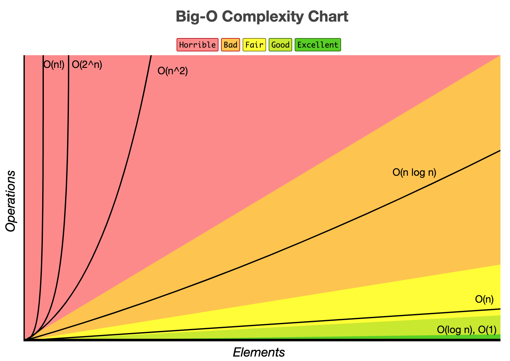
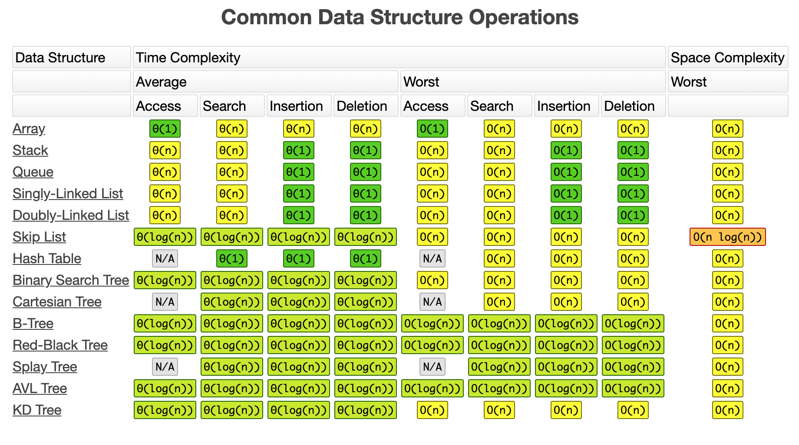
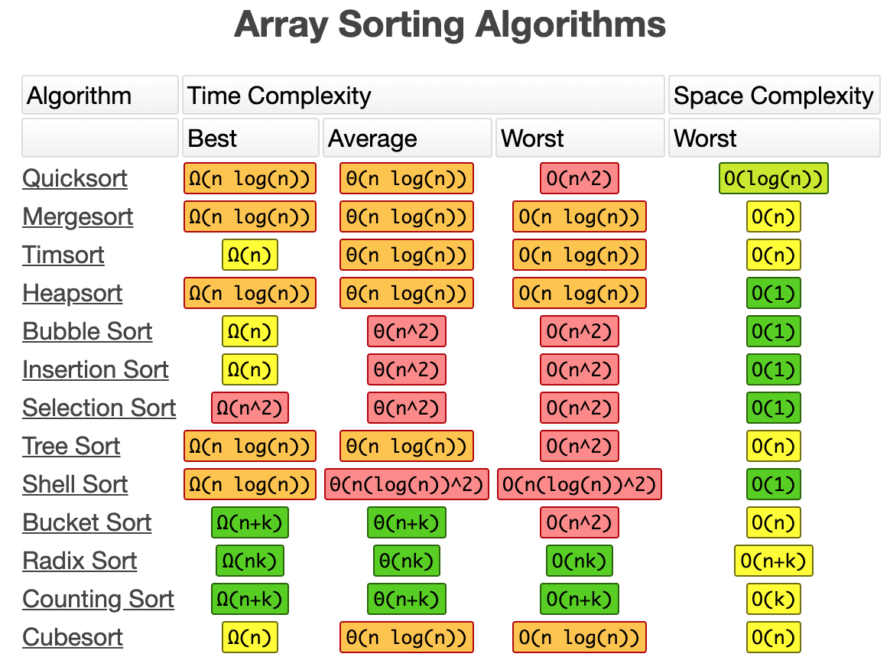

## Algorithmic Changes

Link: http://bigocheatsheet.com

If you're not changing the data, the other main option is to change the code.

The biggest improvement is likely to come from an algorithmic change. This is the equivalent of replacing *bubble sort* (O(n^2)) with *quicksort* (O(n log n)) or replacing a linear *scan through an array* (O(n)) with a *binary search* (O(log n)) or a *map lookup* (O(1)).

This is how software becomes slow. Structures originally designed for one use is repurposed for something it wasn't designed for. This happens gradually.

It's important to have an intuitive grasp of the different big-O levels. Choose the right data structure for your problem. You don't have to always shave cycles, but this just prevents dumb performance issues that might not be noticed until much later.

The basic classes of complexity are:

#### O(1)
A field access, array or map lookup

Advice: don't worry about it (but keep in mind the constant factor.)

#### O(log n): binary search

Advice: only a problem if it's in a loop

#### O(n): simple loop

Advice: you're doing this all the time

#### O(n log n): divide-and-conquer, sorting

Advice: still fairly fast

#### O(n*m): nested loop / quadratic

Advice: be careful and constrain your set sizes

#### Anything else between quadratic and subexponential

Advice: don't run this on a million rows

#### O(b ^ n), O(n!): exponential and up

Advice: good luck if you have more than a dozen or two data points

