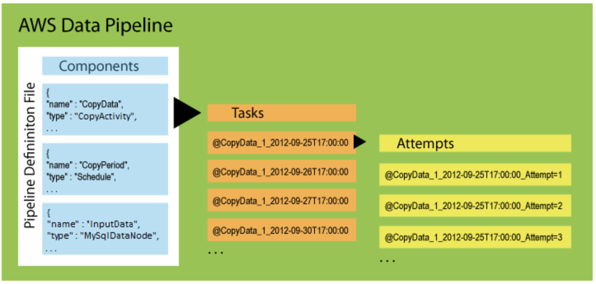

# AWS Data Pipeline

When 'DP' runs a pipeline, it compiles the components to create a set of _actionable instances_. Each instance contains all the information for performing a specific task.

To provide robust data management, DP retries a failed operation. it continues to do so until the task reaches the max # of allowed retries. Attempt objects track the various attempts, retries and failures.

AWS Data Pipeline hands the _instances_ out to **task runners** to process.

### Pipeline Components
Pipeline components represent the business logic of the pipeline and are represented by the different sections of a pipeline definition.

Specify:
- Data sources
- Activities
- Schedule
- Preconditions of the workflow

Can inherift properties from parent components.