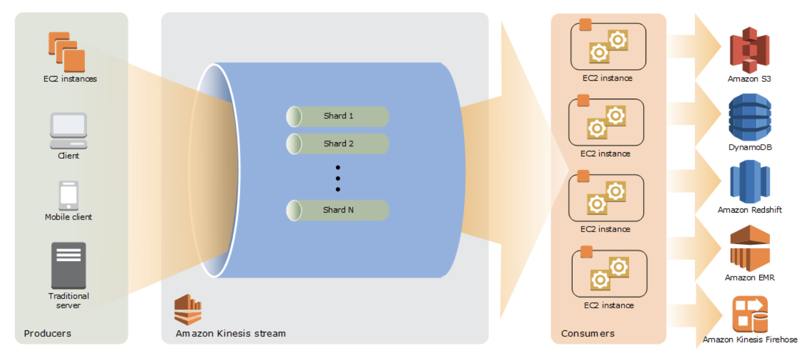

# Kinesis

[Key Concepts](https://docs.aws.amazon.com/streams/latest/dev/key-concepts.html)

You can add data to an Amazon Kinesis data stream via PutRecord and PutRecords operations, Amazon Kinesis Producer Library (KPL), or Amazon Kinesis Agent.

**note how KPL and kinesis agent are different.KPL is only available on Java and C+

## Kinesis Streams


### Kinesis Data Streams

A Kinesis data stream is a set of shards. Each **shard** has a sequence of **data records**. Each **data record** has a sequence number that is assigned by Kinesis Data Streams

```
- Shard 1
    - Data Records: [{seq#:1}, {seq#:2}, {seq#:3}]

- Shard 2
    - Data Records: [{seq#:4}, {seq#:5}, {seq#:6}]
- Shard 3 ...
```

**Data Streams API** -  Data Streams API can be consumer to the Data Stream but cannot deaggregate the data.

#### Shards

Each shard has a sequence of data records. A shard is a uniquely identified sequence of data records in a stream. A stream is composed of one or more shards, each of which has a **fixed unit of capacity**.

. Each shard can support up to **5 transactions per second** for **reads**, up to a maximum total data read rate of **2 MB per second** and up to **1,000 records per second** for **writes**, up to a maximum total data write rate of **1 MB per second** (including partition keys). 

The total capacity of the stream is the sum of the capacities of its shards.

#### Partition Key
A **partition key** is used to **group data by shard** within a stream.

Kinesis Data Streams segregates the **data records** belonging to a **stream** into **multiple shards**. 

It uses the **partition key** that is associated with each data record to determine **which shard** a given **data record** belongs to.

Partition keys are Unicode strings with a **maximum** length limit of **256 bytes**.

#### Sequence Number

#### Retention Period
The retention period is set at the stream level. The **retention period** is the length of time that data records are accessible after they are added to the stream. 

`Default retention period`: **24 hours** after creation
You can increase the retention perioud up to **168 hours (7 days)**

#### Data Records
A data record is the unit of data stored in a Kinesis data stream. 

Composed of: \
- Sequence number
- Partition key
- Data blob (immutable sequence of bytes)
    - KDS does not inspect/interpret/modify the data blob
    - Can be up to 1 MB

#### Server-side Encryption

Kinesis Data Streams can automatically encrypt sensitive data as a producer enters it into a stream.

Kinesis Data Streams uses **AWS KMS master keys** for encryption
    - `Note`: Using server-side encryption incurs AWS Key Management Service (AWS KMS) costs

### Kinesis Video Streams

### Producers

Producers are the systems sending data.
You can send data using:
- KPL ( Kinesis Producer Library)
- Kinesis Agent
- Kinesis API

### Consumers

Consumer can be implemented with

- Kinesis Client Library ( KCL )
    - This is a pre-built library that helps you easily build Amazon Kinesis Applications for reading and processing data from an Amazon Kinesis stream. This library handles complex issues such as adapting to changes in stream volume, load-balancing streaming data, coordinating distributed services, and processing data with fault-tolerance, enabling you to focus on business logic while building applications.
- Kinesis Connector Library
    - Used to connect Kinesis with other services on AWS. KCL is required to use this Library
- Kinesis Data Streams API (but KCL is recommended)

## Data Firehouse

Lambda Blueprints

Kinesis Data Firehose provides the following Lambda blueprints that you can use to create a Lambda function for data transformation.

• **General Firehose Processing** — Contains the data transformation and status model described in the previous section. Use this blueprint for any custom transformation logic.
• **Syslog to JSON** — Parses and converts Syslog lines to JSONobjects, using predefined JSON field names.
• **Syslog to CSV** — Parses and converts Syslog lines to CSV format.
• **Kinesis Data Firehose Process Record Streams as source** — Accesses the Kinesis Data Streams records in the input and returns them with a processing status.
• **Kinesis Data Firehose CloudWatch Logs Processor** — Parses and extracts individual log events from records sent by CloudWatch Logs subscription filters.


## KCL - Kinesis Client Library

The KCL performs the following tasks:

- Connects to the stream
- Enumerates the shards
- Coordinates shard associations with other workers (if any)
- Instantiates a record processor for every shard it manages
- Pulls data records from the stream
- Pushes the records to the corresponding record processor
- Checkpoints processed records
- Balances shard-worker associations when the worker instance count changes
- Balances shard-worker associations when shards are split or merged

KCL uses a unique Amazon DynamoDB table to keep track of the application's state.

KCL uses the name of the Amazon Kinesis Data Streams application to create the name of the table, each application name must be unique.

Can be monitored with CloudWatch.

#### Enhanced Fan-Out

This feature enables consumers to receive records from a stream with throughput of up to **2 MiB of data per second** per shard. 

Throughput is **dedicated**, which means that consumers that use enhanced fan-out **don't have to contend with other consumers** that are receiving data from the stream.


## KPL - Kinesis Producer Library

https://docs.aws.amazon.com/streams/latest/dev/developing-producers-with-kpl.html

Acts as an intermediary between your application and the Kinesis Data Streams API.

KPL simplifes producer application development
and also building batch of aggregation of user records by increasing payload size and improve
throughput and optimize costs.

Validate the transaction by checking the successful insert into the stream by embedding automatic and confgurable retry mechanism

Kinesis Streams provide capabilities to use Future objects to validate UserRecords. No need to complicate the code by storing in memory/transient storage.

Time-to-live records need to be increases if the UserRecords could not inserted into stream in time.

### Kinesis Connector Library 

Helps java developers integrate Kinesis Streams with other AWS services.

The library provides connectors to various AWS services including S3. 

Each Amazon Kinesis connector application is a pipeline that understands how records from Kinesis Stream will be handled.

#### Kinesis agent

Kinesis Agent is a stand-alone Java application that can easily collect and send data to Kinesis Data Streams. 

The agent can continuously monitor set of fles (more for log fles) and Aggregation of data is not possible.