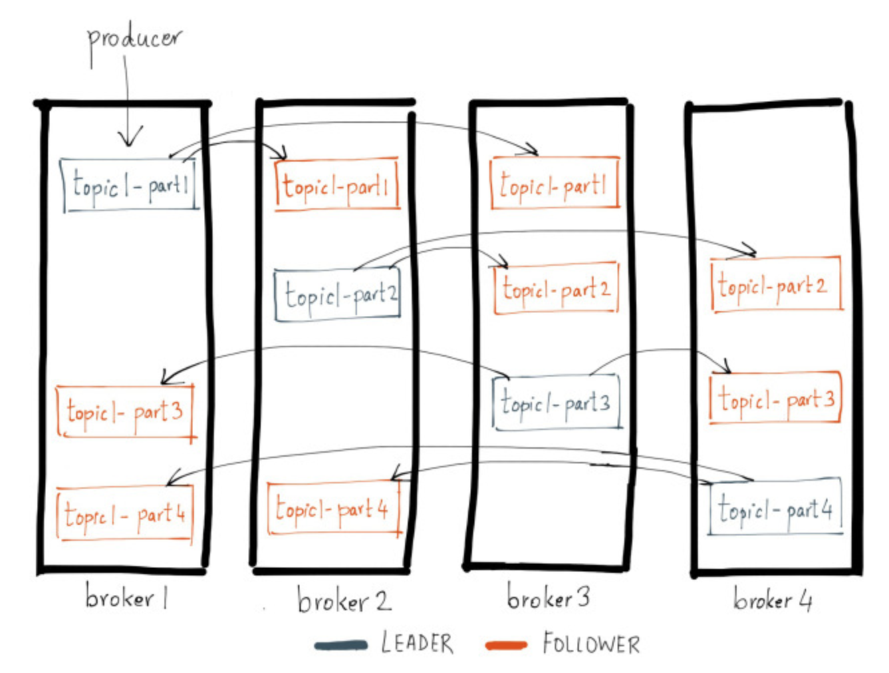

## Kafka 

**Kafka** = log-oriented message queue. 

Useful for distributing any workload that looks like **"tail a log and process each line as it comes in"** across a large number of nodes.

#### Kafka big win
Apart from the schema, introducing Kafka completely decouples producers and consumers of messages. 

That in turn reduces the required coordination between independent teams within an organisation.

### Replication

### Zookeeper
Centralized service for maintaining configuration information, naming, providing distributed synchronization, and providing group services. 

All of these kinds of services are used in some form or another by distributed applications. 

### Kafka Connect 
Built-in framework for writing sources and sinks that either continuously ingest data into Kafka or continuously ingest data in Kafka into external systems. 

The connectors themselves for different applications or data systems are federated and maintained separately from the main code base. You can find a list of available connectors at the [Confluent Hub](http://www.confluent.io/developers/connectors).

#### Confluent Schema Registry

### Kafka Streams

#### Vocabulary
**Push architectures**: all control on the producer, painful in the face of an unreliable consumer.

**Pull architectures**: all control on the consumer, painful in the face of an unreliable producer.

**Message queues** allow the producer to think it's participating in a push architecture, while the consumer believes it's a pull-based arch. 

Because the message queue itself does very little work, it gets to play a very well-behaved consumer insofar as the producer is concerned, while behaving like a well-behaved producer for the consumer. 

The queue's buffering then allows both the producer and the consumer to misbehave to some degree while the queue itself keeps the illusion of good behaviour.