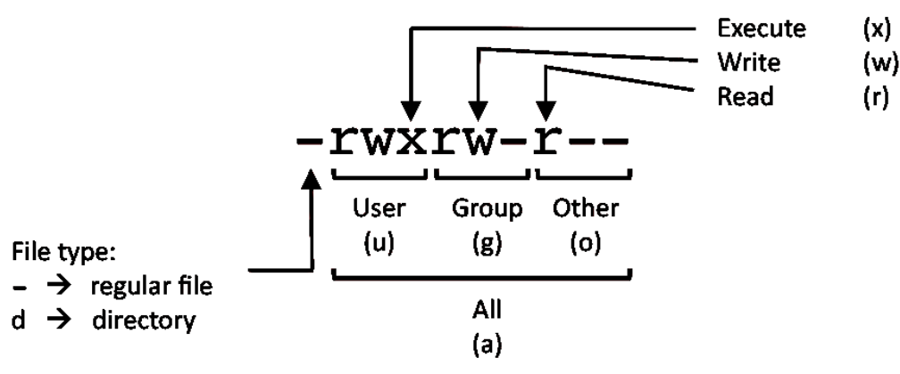

# Linux

https://www.linuxtrainingacademy.com/linux-commands-cheat-sheet/#1_8211_SYSTEM_INFORMATION

## System Information

#### Show system host name
`hostname`

#### Display the IP addresses of the host
`hostname -I`

#### Show system reboot history
`last reboot`

#### Show the current date and time
`date`

#### Show this month's calendar
`cal`

#### Display who is online
`w`

#### Who you are logged in as
`whoami`

## Hardware & Info

#### Display CPU information
`cat /proc/cpuinfo`

#### Display memory information
`cat /proc/meminfo`

#### Display free and used memory 
( -h for human readable, -m for MB, -g for GB.)

`free -h`

## Performance Monitoring & Statistics

Execute "df -h", showing periodic updates

`watch df -h`

#### Display and manage the top processes
`top`

#### Interactive process viewer (top alternative)
`htop`

#### Display processor related statistics
`mpstat 1`

#### Display virtual memory statistics
`vmstat 1`

#### Display I/O statistics
`iostat 1`

#### Display the last 100 syslog messages 

(Use /var/log/syslog for Debian based systems.)

`tail 100 /var/log/messages`

#### Capture and display all packets on interface eth0
`tcpdump -i eth0`

#### Monitor all traffic on port 80 ( HTTP )
`tcpdump -i eth0 'port 80'`

#### List all open files on the system
`lsof`

#### List files opened by user
`lsof -u user`

## Process Management
#### Display your currently running processes
`ps`

#### Display all the currently running processes on the system.
`ps -ef`

#### Display process information for processname
`ps -ef | grep processname`

#### Display and manage the top processes
`top`

#### Interactive process viewer (top alternative)
`htop`

#### Kill process with process ID of pid
`kill pid`

#### Kill all processes named processname
`killall processname`

## Networking
Display all network interfaces and ip address
`ifconfig -a`

Display eth0 address and details
`ifconfig eth0`

Query or control network driver and hardware settings
`ethtool eth0`

Send ICMP echo request to host
`ping host`

Display whois information for domain
`whois domain`

Display DNS information for domain
`dig domain`

Reverse lookup of IP_ADDRESS
`dig -x IP_ADDRESS`

Display DNS ip address for domain
`host domain`

Display the network address of the host name.
`hostname -i`

Display all local ip addresses
`hostname -I`

Download http://domain.com/file
`wget http://domain.com/file`

Display listening tcp and udp ports and corresponding programs
`netstat -nutlp`

## SSH Logins

#### Connect to host as your local username.
`ssh host`

#### Connect to host as user
`ssh user@host`

#### Connect to host using port
`ssh -p port user@host`

## File Transfers

Secure copy file.txt to the /tmp folder on server
`scp file.txt server:/tmp`

Copy *.html files from server to the local /tmp folder.
`scp server:/var/www/*.html /tmp`

Copy all files and directories recursively from server to the current system's /tmp folder.
`scp -r server:/var/www /tmp`

Synchronize /home to /backups/home
`rsync -a /home /backups/`

Synchronize files/directories between the local and remote system with compression enabled
`rsync -avz /home server:/backups/`

## Disk Usage
#### Show free and used space on mounted filesystems
`df -h`

#### Show free and used inodes on mounted filesystems
`df -i`

#### Display disks partitions sizes and types
`fdisk -l`

#### Display disk usage for all files and directories in human readable format
`du -ah`

#### Display total disk usage off the current directory
`du -sh`

## File Permissions

        PERMISSION      EXAMPLE

         U   G   W
        rwx rwx rwx     chmod 777 filename
        rwx rwx r-x     chmod 775 filename
        rwx r-x r-x     chmod 755 filename
        rw- rw- r--     chmod 664 filename
        rw- r-- r--     chmod 644 filename

##### NOTE: Use 777 sparingly!

        LEGEND
        U = User
        G = Group
        W = World

        r = Read
        w = write
        x = execute
        - = no access