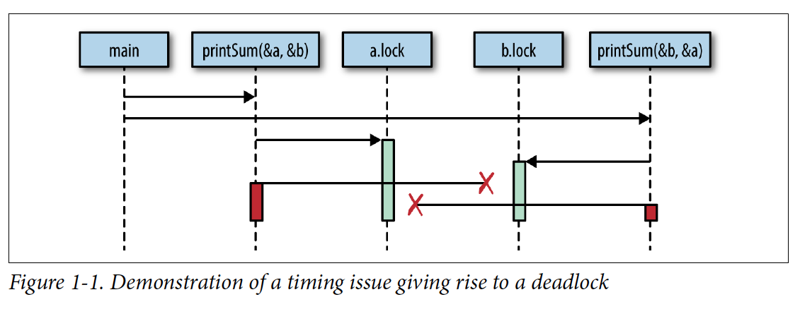
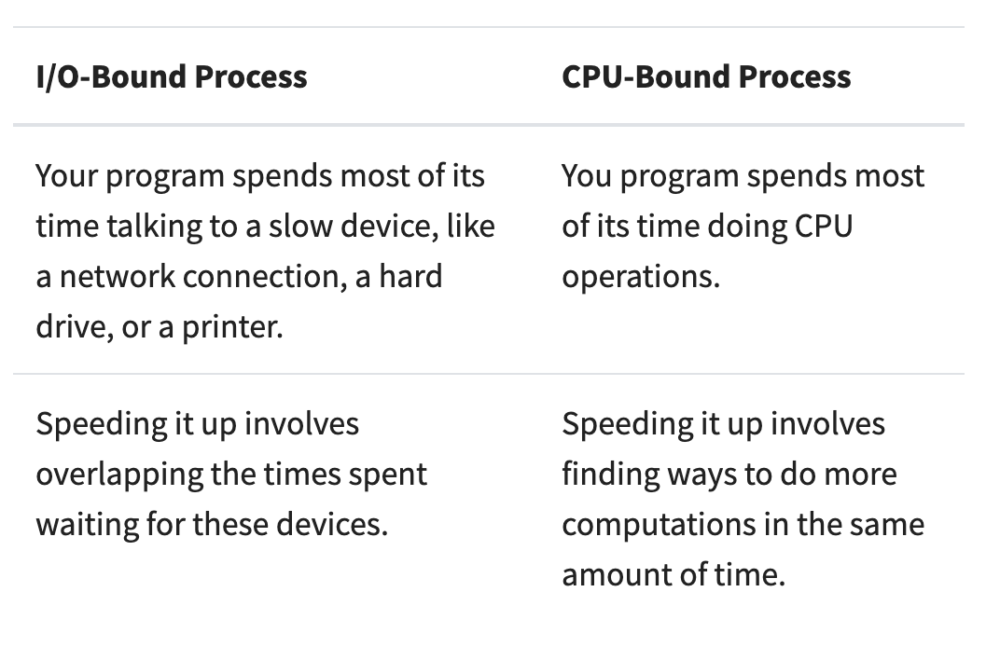
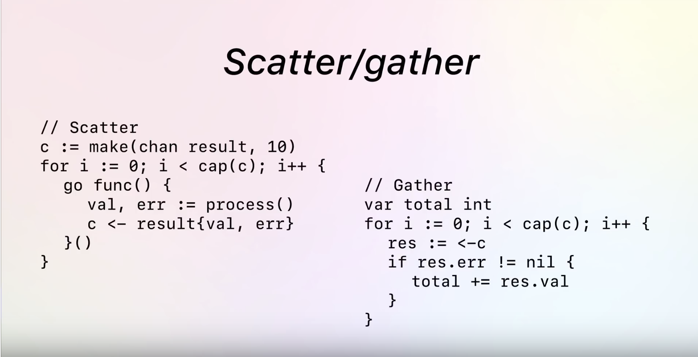

# Go the language stuff

## Examples

Example programs and code:

**Closure**
**HTTPS Request**
**Pointers**
**Sockets**
**Walk Dir**: a program to walk a filesystem directory, recursively or not. WIP for TODO [item](../TODO.md)

## Concurrency

Techniques, design patterns, and definitions for concurrency in Go

**Critical section**: Part of program where data that is shared between threads is acted upon

**Deadlock**: Thread 1 needs resource from thread 2, thread 2 needs resource from thread 1, neither will give the other the resource until the other one does first.
Example:

**Livelock**: when 2 threads don't advance the program
(Imagine 2 people walking towards eachother in a hallway, each move to try and get out of the others way, this goes on forever...)

### I/O vs. CPU Bound Processes

### Techniques

## Cracking the Go Interview

Some Go solutions to problems from the famous book Cracking the Coding Interview

#### Chapter 16 Moderate
**Number swapper**
Use XOR

**Word frequencies**
Use hashmap if you think you'll do it more than once

**Intersection**
Find slope and y intercept